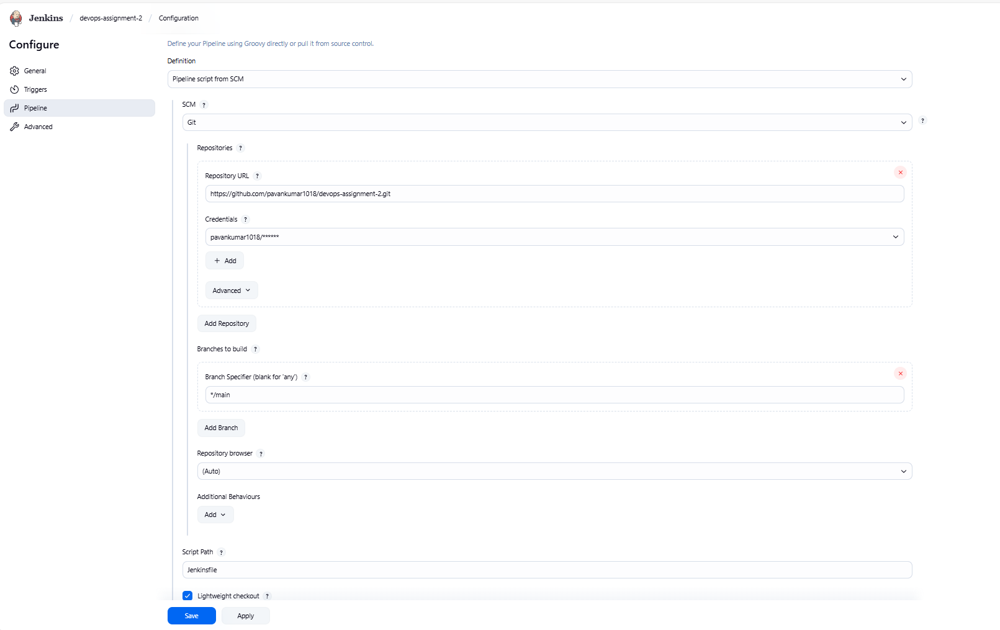
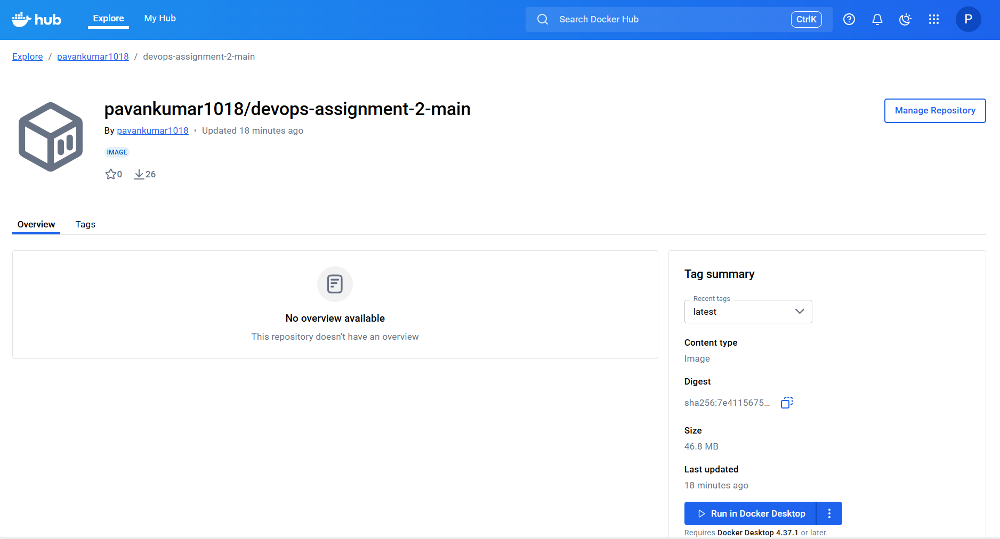
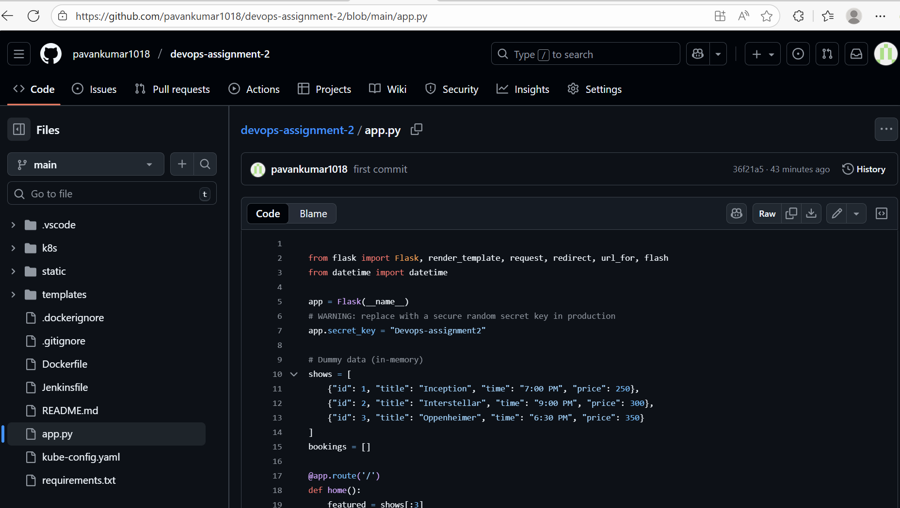
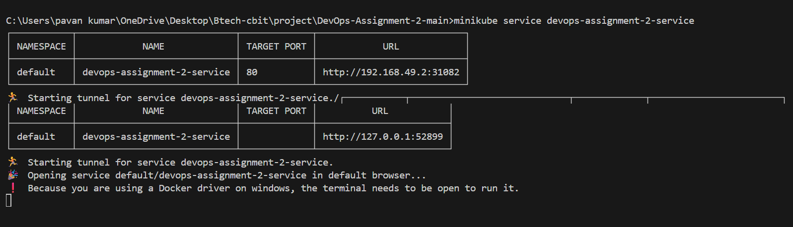
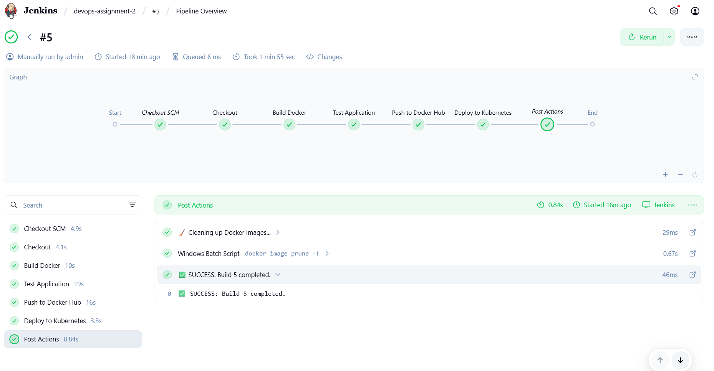
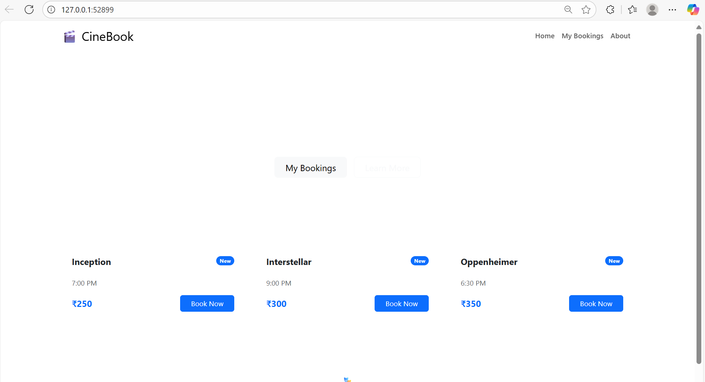

# DevOps Assignment 2 - Movie Ticket Booking Platform with CI/CD Pipeline


A production-ready Flask web application for movie ticket booking with complete CI/CD pipeline using Jenkins, Docker, and Kubernetes deployment.

## 🎯 Overview

This project demonstrates a complete DevOps workflow for a Flask web application, including:

- Containerized application using Docker
- Automated CI/CD pipeline with Jenkins
- Kubernetes orchestration for production deployment
- Automated testing and deployment stages

## 🌐 About Web Application

The Movie Ticket Booking Platform allows users to:

- Browse currently playing movies
- Check showtimes and seat availability
- Select preferred seats
- Complete bookings with secure payment options

It provides a responsive UI with real-time seat selection, intuitive navigation, and a seamless booking experience.

## ✨ Features

- **Flask Web Application**: Lightweight Python server
- **Docker Containerization**: Multi-stage Docker builds for optimized images
- **Kubernetes Deployment**: Production-ready manifests with multiple replicas
- **Jenkins Pipeline**: Automated CI/CD pipeline for build, test, and deployment
- **Docker Hub Integration**: Automated image push to Docker Hub registry
- **Health Checks**: Automated application health monitoring
- **Load Balancing**: Kubernetes LoadBalancer for external access

## 🏗️ Architecture

                 ┌──────────────────────────┐
                 │    GitHub Repo           │
                 │ 12Venky/Movie-Ticket-App │
                 └─────────┬────────────────┘
                           │
                           ▼
                 ┌────────────────────┐
                 │      Jenkins       │
                 │  CI/CD Pipeline    │
                 └─────────┬──────────┘
                           │
                           ▼
                 ┌──────────────────────────┐
                 │      Docker Hub          │
                 │ 18venky/movie-ticket-app │
                 └─────────┬────────────────┘
                           │
                           ▼
                 ┌────────────────────┐
                 │   Kubernetes       │
                 │   Cluster (Pods)   │
                 └─────────┬──────────┘
                           │
                           ▼
                 ┌────────────────────┐
                 │  LoadBalancer      │
                 │  Service (External)│
                 └────────────────────┘
                           │
                           ▼
                 ┌────────────────────┐
                 │   Users / Clients  │
                 └────────────────────┘


This shows how the source code from GitHub flows through Jenkins, gets built into a Docker image, pushed to Docker Hub, deployed to Kubernetes, and finally accessed by users through a LoadBalancer.

## 📦 Prerequisites

- **Python 3.10+**: [Download Python](https://www.python.org/downloads/)
- **Docker**: [Install Docker](https://docs.docker.com/get-docker/)
- **Kubernetes (kubectl)**: [Install kubectl](https://kubernetes.io/docs/tasks/tools/)
- **Minikube** (for local K8s): [Install Minikube](https://minikube.sigs.k8s.io/docs/start/)
- **Jenkins**: [Install Jenkins](https://www.jenkins.io/doc/book/installing/)
- **Git**: [Install Git](https://git-scm.com/downloads)

## 📁 Project Structure
```bash
DevOps-Assignment-2/
│
├── app.py                      # Main Flask application
├── requirements.txt             # Python dependencies
├── Dockerfile                   # Docker image configuration
├── Jenkinsfile                  # Jenkins pipeline definition
├── README.md                    # Project documentation
├── .gitignore                   # Git ignore rules
├── .dockerignore                # Docker ignore rules
│
├── templates/                   # Flask HTML templates
│   ├── index.html
│   ├── movies.html
│   ├── seat_selection.html
│   └── payment.html
│
├── static/                      # Static assets
│   ├── css/                     # Stylesheets
│   └── js/                      # JavaScript files
│
├── k8s/                         # Kubernetes manifests
│   ├── deployment.yaml
│   └── service.yaml
│
├── screenshots/                 # Documentation screenshots
│
└── __pycache__/                 # Python cache (auto-generated)

```

## Screenshots

### 1. Jenkins Pipeline Configuration

*Jenkins job configuration showing Git repository integration and build triggers*

### 2. Docker Hub Repository

*Docker Hub repository showing the successfully pushed container image*

### 3. GitHub Repository Structure

*Source code structure on GitHub showing the Flask application and configuration files*

### 4. Kubernetes Deployment

*Kubernetes service deployment using Minikube with accessible service URL*

### 5. Jenkins Pipeline Execution

*Successful Jenkins pipeline execution with all stages completed*

### 6. Application Website

*CineBook application homepage showing available movies and booking options*


## 🚀 Local Development

```bash
# Clone repository
git clone https://github.com/12Venky/DevOps-Assignment-2.git
cd DevOps-Assignment-2

# Install dependencies
pip install -r requirements.txt

# Run Flask app
python app.py
```
## 🐳 Docker Deployment
```bash

# Build Docker image
docker build -t 18venky/ticket-booking-flask:latest .


# Run container
docker run -d -p 5000:5000 18venky/ticket-booking-flask:latest

# Stop and remove container
docker stop movie-app && docker rm movie-app

```

## Push to Docker Hub:

```bash 
docker tag movie-ticket-app 18venky/ticket-booking-flask:latest
docker login
docker push 18venky/ticket-booking-flask:latest

```
## ☸️ Kubernetes Deployment
```bash
# Start Minikube
minikube start

# Apply Kubernetes manifests
kubectl apply -f k8s/

# Check status
kubectl get pods
kubectl get services
```

Scale replicas:
```bash

kubectl scale deployment ticket-booking-flask --replicas=3
```
## Delete deployment:
```bash
kubectl delete -f k8s/
```
## 🔄 CI/CD Pipeline

The CI/CD pipeline automates the build, test, push, and deployment process of the Movie Ticket Booking Platform using **Jenkins**, **Docker**, and **Kubernetes**.

### Pipeline Stages

1. **Checkout Code**
   - Clones the latest code from GitHub repository.
   - Ensures Jenkins always builds the latest version.

2. **Build Docker Image**
   - Builds a Docker image from the `Dockerfile`.
   - Tags the image with your Docker Hub repository.

3. **Test Application**
   - Runs automated health checks on the container.
   - Ensures application is working before deployment.

4. **Push to Docker Hub**
   - Pushes the tested Docker image to Docker Hub registry.
   - Allows Kubernetes to pull the image for deployment.

5. **Deploy to Kubernetes**
   - Applies Kubernetes manifests (`deployment.yaml` and `service.yaml`).
   - Deploys the application with configured replicas and load balancing.

---

### Jenkins Setup

1. **Install Jenkins** and required plugins:
   - Docker Pipeline
   - Kubernetes CLI
   - Git

2. **Configure Jenkins Credentials**:
   - **Docker Hub Credentials**
     - Kind: Username with Password
     - ID: `docker-hub-cred`
     - Username: `12venky`
     - Password: Docker Hub password/token
   - **Kubernetes Config**
     - Kind: Secret file
     - ID: `kubeconfig`
     - File: Upload your `~/.kube/config`

3. **Create Pipeline Job**
   - New Item → Pipeline
   - Configure SCM to point to GitHub repository
   - Select `Jenkinsfile` as the pipeline script

4. **Run the Pipeline**
   - Click "Build Now"
   - Monitor stages and logs in Jenkins dashboard

---

### Pipeline Environment Variables

```groovy
DOCKERHUB_CREDENTIALS = credentials('docker-hub-cred')
DOCKER_IMAGE = '18venky/movie-ticket-app'
K8S_NAMESPACE = 'default'

```

##  👤 Author
Venkateshwararao Daravath

GitHub: https://github.com/12Venky

Docker Hub: https://hub.docker.com/u/18venky

## 🙏 Acknowledgments

- Flask framework for the web application
- Docker for containerization
- Kubernetes for orchestration
- Jenkins for CI/CD automation


